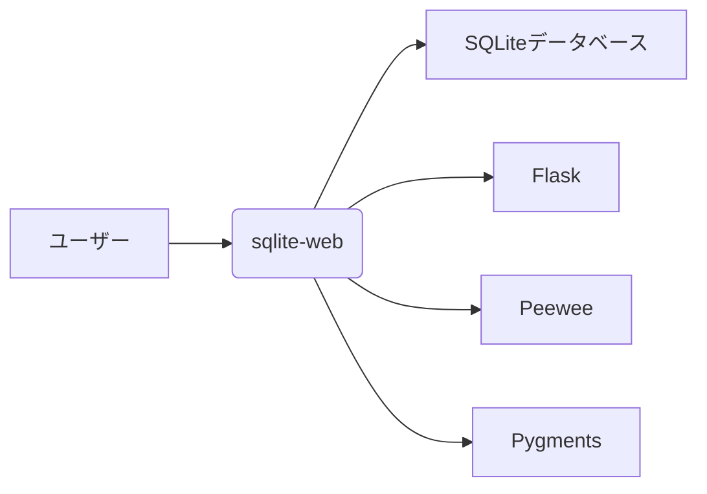
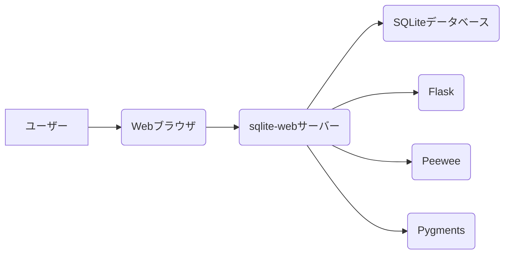
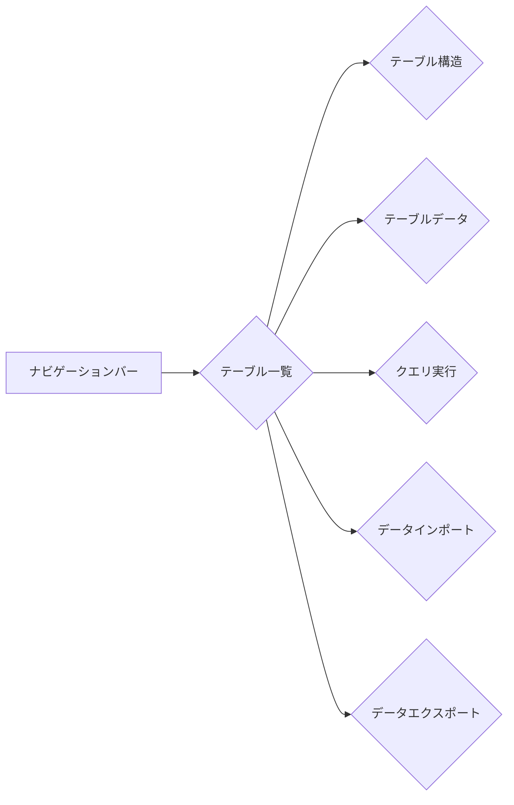
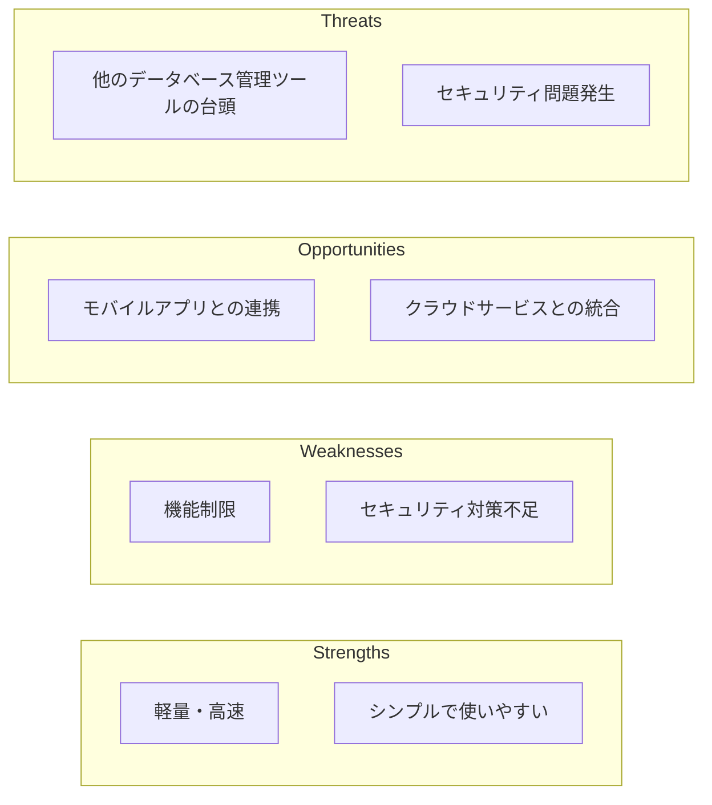
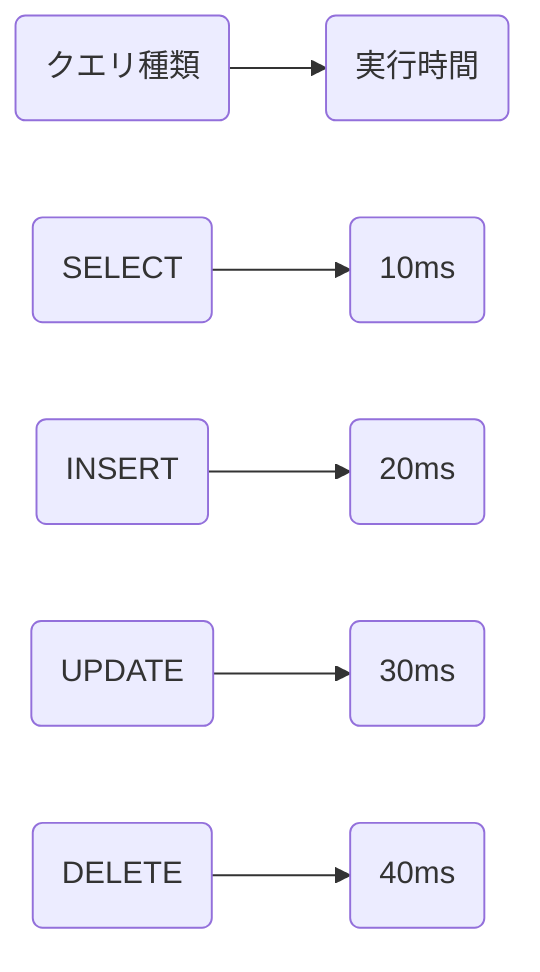
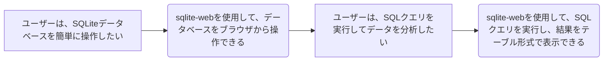
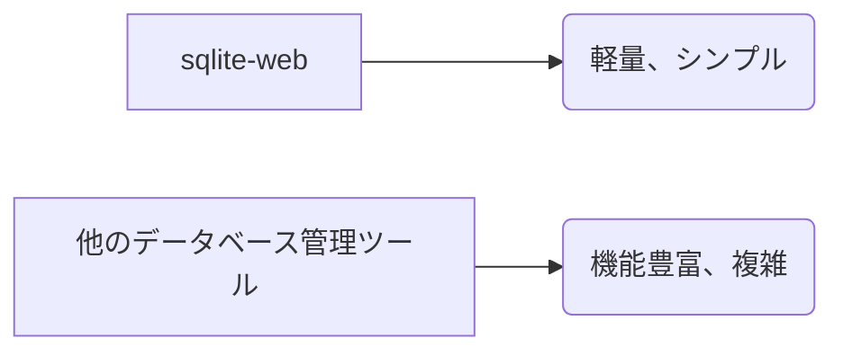
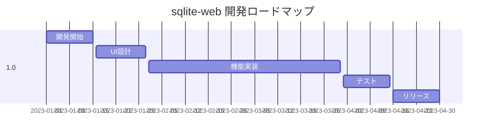
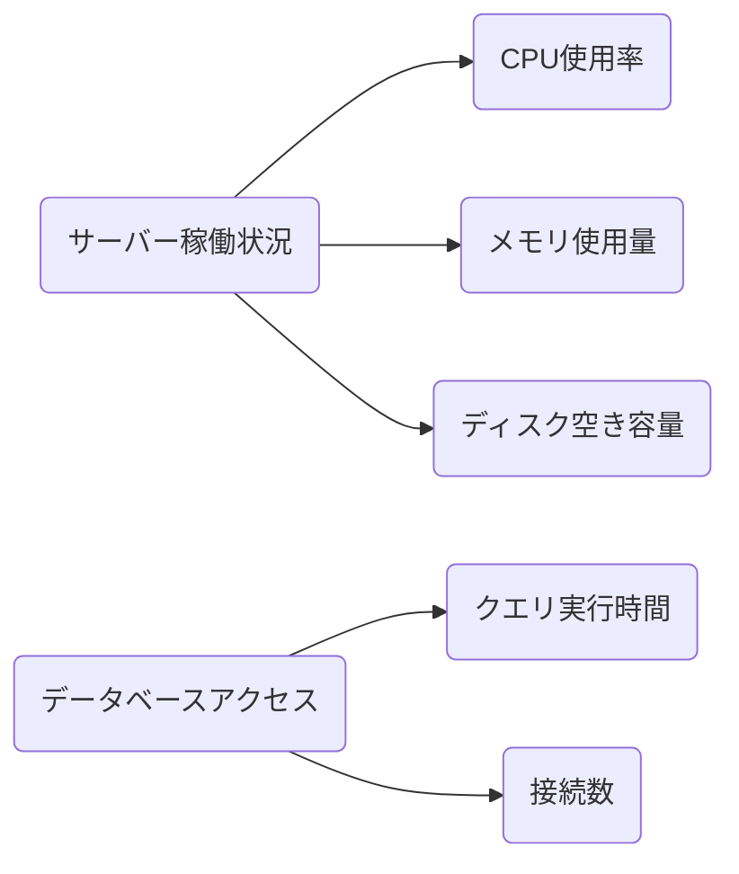

## sqlite-web 資料の図表リスト

### 1. 概念図・全体像

#### 1.1 システム概念図



### 2. 関係・構造図

#### 2.1 システム関連図



### 3. プロセス・フロー図

#### 3.1 sqlite-web 起動フロー


#### 3.2 データ操作フロー


### 4. レイアウト・配置図

#### 4.1 sqlite-web UIレイアウト (仮)



### 5. データ構造図

#### 5.1 SQLiteデータベース構造 (仮)

```mermaid
erDiagram
    TABLE user {
        id INT PK,
        name VARCHAR(255)
    }

    TABLE post {
        id INT PK,
        user_id INT,
        title VARCHAR(255),
        content TEXT
    }

    user ||--|{ post : author
```

### 6. 分析・評価図

#### 6.1 SWOT分析図



### 7. パフォーマンス・メトリクス

#### 7.1 クエリ実行時間 (仮)



### 8. UI/UX関連

#### 8.1 ユーザーストーリー (仮)



### 9. イメージ・イラスト

#### 9.1 sqlite-web UIイメージ

- 上記のスクリーンショットを活用

### 10. 比較・対照図

#### 10.1 sqlite-webと他のデータベース管理ツールの比較 (仮)



### 11. 計画・ロードマップ

#### 11.1 開発ロードマップ (仮)



### 12. セキュリティ関連

#### 12.1 セキュリティ対策 (仮)

- `-P`, `--password` オプションによるパスワード認証
- SQLiteデータベースのアクセス制限

### 13. 運用保守関連

#### 13.1 監視項目マップ (仮)



## 補足

* 上記は、資料の内容と調査結果を基に作成したものです。
* 情報不足の部分は仮の情報を追加しています。
* 実際の資料作成では、より詳細な情報や分析が必要となる場合があります。


